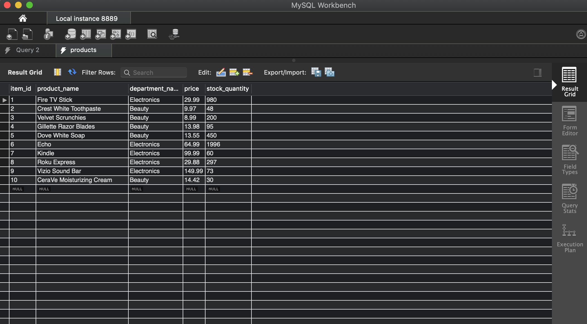
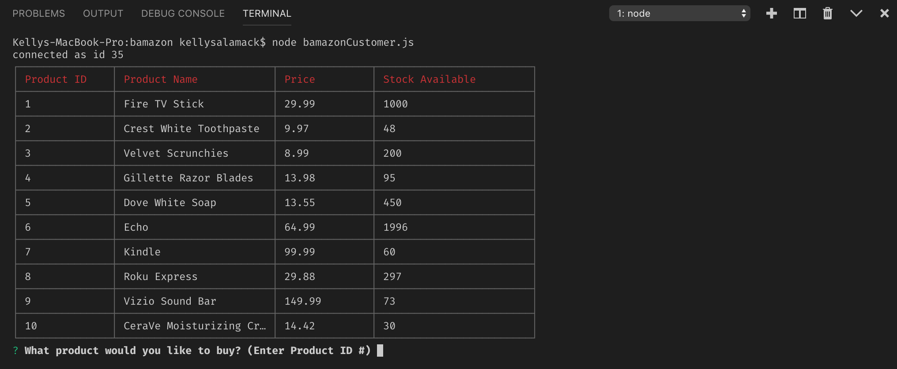
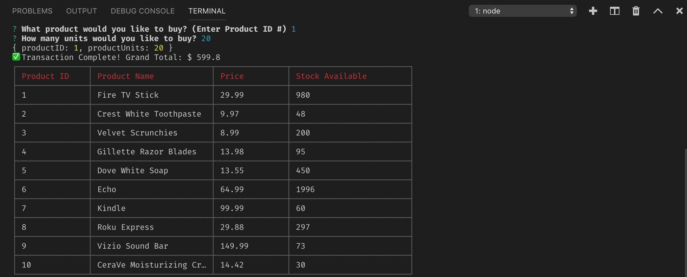

# bamazon

I created an Amazon-like storefront with MySQL skills learned in this unit. The app takes in orders from customers and deplete stock from the store's inventory.

### Steps:

1. Create a MySQL Database called `bamazon`.

2. Then create a Table inside of that database called `products`.

3. The products table should have each of the following columns:

   * item_id (unique id for each product)

   * product_name (Name of product)

   * department_name

   * price (cost to customer)

   * stock_quantity (how much of the product is available in stores)

4. Populate this database with 10 different products

5. Then create a Node application called `bamazonCustomer.js`. Running this application will first display all of the items available for sale. Include the ids, names, and prices of products for sale.

6. The app then prompts users with two messages:

   * The ID of the product they would like to buy
   * How many units of the product they would like to buy

7. Once the customer has placed the order, the application checks if the store has enough of the product to meet the customer's request

   * If not, the app logs `Out of Stock!` & prevents the order from going through.

8. However, if the store _does_ have enough of the product, it fulfills the customer's order.
   * This means updating the SQL database reflects the remaining quantity.
   * Once the update goes through, the customer sees the total cost of their purchase.

